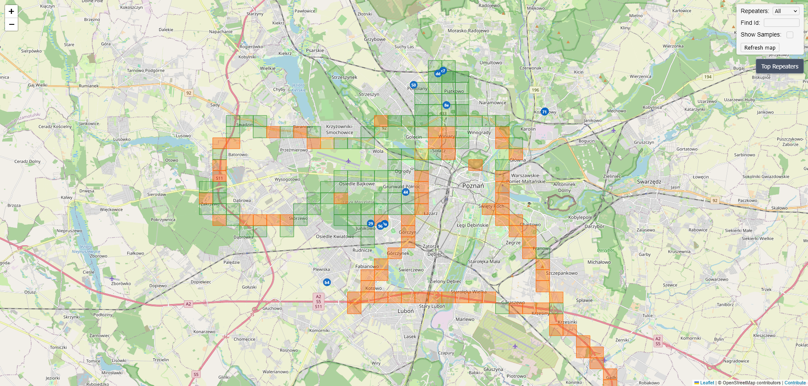

## Wardrive
Aplikacja pozwalająca monitorować pokrycie naszego obszaru działania siecią MeshCore.

* [Mapa pokrycia](https://michal.duckdns.org:13443) - Pokazuje pokrycie terenu zasieciem sieci MeshCore oraz repeatery odkryte w siatce. Wybierając dany kwadrat można podejrzeć, które repeatery do niego sięgają. Wybierając repeater można podejrzeć wszystkie kwadraty do których sięga jego zasięg.
* [Narzędzie do mapowania](https://michal.duckdns.org:13443/wardrive.html) - Aplikacja pozwala mapować pokrycie terenu zasiegiem sieci. Wymaga przeglądarki opartej o Chromium (lub Bluefy dla iOS). Po połączeniu z companionem, pozwala na manualne lub automatyczne wysyłanie wiadomości z aktualną pozycją na kanał `#wardrive`, co pozwala ustalić zasięg.
* [Instrukcja](https://michal.duckdns.org:13443/howto) - Instrukcja używania narzędzia. Warto przeczytać, by uniknąć znanych problemów.
